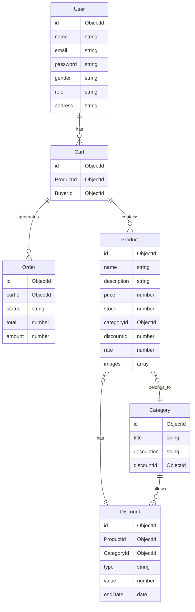

```mermaid
erDiagram
    User {
        id ObjectId
        name string
        email string
        password string
        gender string
        role string
        address string
    }

    Order {
        id ObjectId
        cartId ObjectId
        status string
        total number
        amount number
    }

    Cart {
        id ObjectId
        ProductId ObjectId
        BuyerId ObjectId
    }

    Category {
        id ObjectId
        title string
        description string
        discountId ObjectId
    }

    Discount {
        id ObjectId
        ProductId ObjectId
        CategoryId ObjectId
        type string
        value number 
        endDate date
    }

    Product {
        id ObjectId
        name string
        description string
        price number
        stock number
        categoryId ObjectId
        discountId number
        rate number
        images array
    }

    User ||--o{ Cart : has
    Cart ||--o{ Product : contains
    Cart ||--o{ Order : generates
    Product }o--|| Category : belongs_to
    Product }o--|| Discount : has
    Category ||--o{ Discount : allows
```